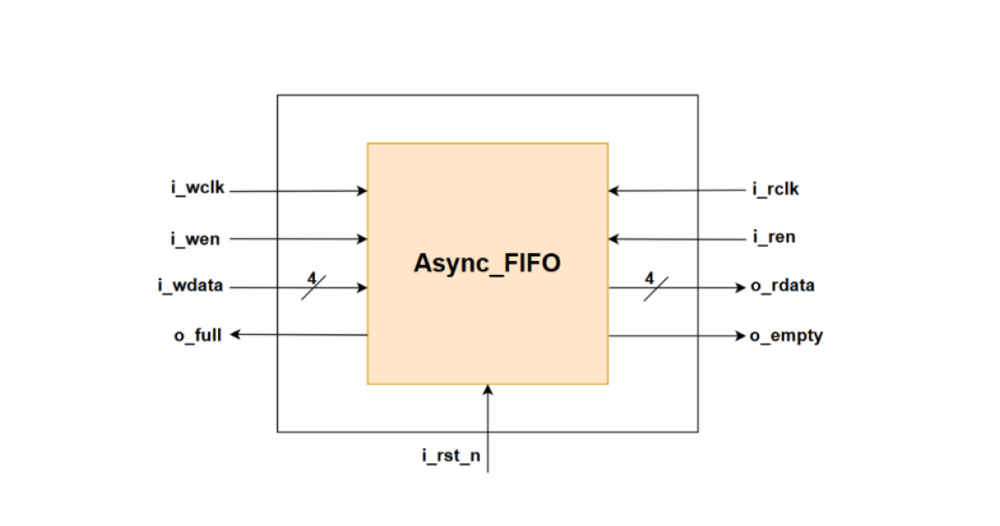
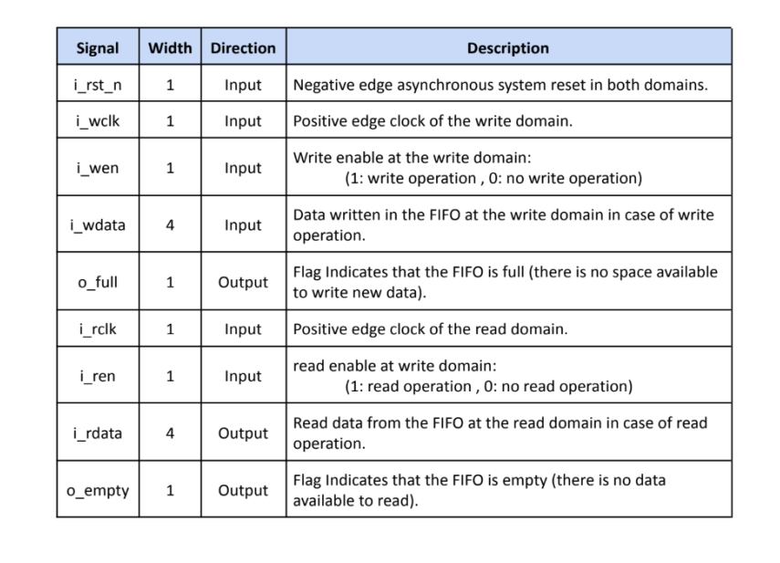
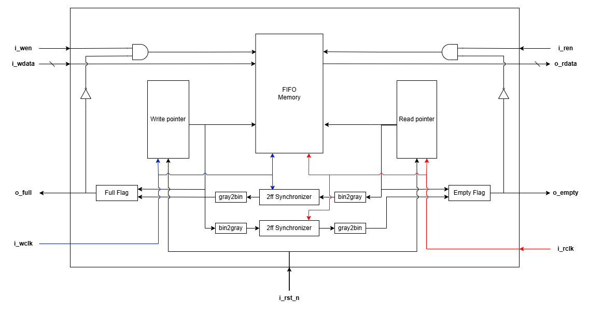

# Asynchronous-FIFO-with-CDC
Designed asynchronous FIFO enabling data transfer across two clock domains. and Implemented (CDC) techniques to ensure data integrity. 
## Top Module 

## Ports 

## Schematic

